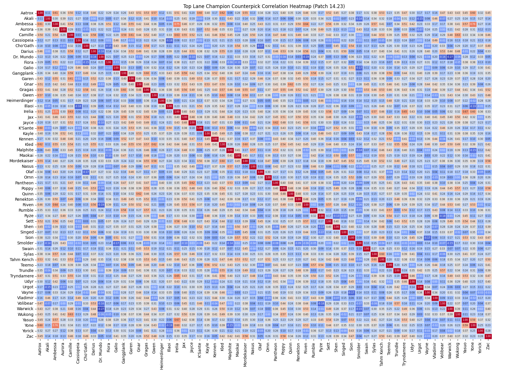

# Installation Guide (Windows only)

### Step 1: Install Git
1. Download Git from [https://git-scm.com](https://git-scm.com).
2. Run the installer and follow the setup wizard with default settings.

### Step 2: Clone the Repository
1. Open Command Prompt:
   - Press `Win + R`, type `cmd`, and press Enter.
2. Navigate to the folder where you want to save the project:
   ```bash
   cd <desired-folder-path>
   ```
   Replace `<desired-folder-path>` with the folder path where you want to clone the project.
3. Clone the repository:
   ```bash
   git clone https://github.com/gabetucker2/lolMatchupGenerator.git
   ```

### Step 3: Navigate to the Project Directory
1. Change to the project folder:
   ```bash
   cd lolMatchupGenerator
   ```

---

## Installing Python on Windows (if not already installed)

### Step 1: Download Python
1. Visit [https://www.python.org/downloads/](https://www.python.org/downloads/) and download the latest version of Python.

### Step 2: Install Python
1. Run the installer.
2. **Important:** Ensure you check the box for **"Add Python to PATH"** during the installation process.
3. Complete the installation by following the wizard prompts.

### Step 3: Verify Installation
1. Open Command Prompt.
2. Type the following command to check the Python version:
   ```bash
   python --version
   ```
   If installed correctly, you should see the version number (e.g., `Python 3.x.x`).

---

## Running the Matchup Generator

### Step 1: Configure Settings
- Open the `config.json` file in the project folder.
- Adjust the settings to your preference, such as adding champions to the `exclude_champions` or `only_include_champions` lists if you don't want certain champions to be included, or if you only want certain champions to be included. If `only_include_champions` has at least one element, the script will ignore `exclude_champions`.

### Step 2: Run the Program
1. Double-click the `run.bat` file in the project folder.
2. A Command Prompt will open, displaying the best top lane champ pools based on the provided data.
3. A heatmap will open, visualizing all champ matchup correlations.

---

Email [gabeqtucker@gmail.com](mailto:gabeqtucker@gmail.com) with any questions!

---

# Heatmap

The **League of Legends Top Lane Matchup Generator** helps you build an optimized champion pool by minimizing counterpicks while maximizing coverage for top lane matchups.



- **Enlarge image here:** [Enlarged image](https://raw.githubusercontent.com/gabetucker2/lolMatchupGenerator/refs/heads/main/heatmap.png)
- **Winrate Data Source:** Extracted from [www.op.gg](https://www.op.gg)  
- **Patch Version:** **14.23**

*This heatmap is meta-agnostic, meaning that how meta a champion is has no impact on the champion's matchup correlations with other champs.*

Ambessa and Yone have a `0.76` correlation. Since this correlation coefficient is so close to `1`, this means they tend to counter similar champs, and they tend to be countered by similar champs. Therefore, Ambessa and Yone would be bad champs to have in the same champ pool.

Conversely, Warwick and Dr. Mundo have a `-0.27` correlation. Since this correlation coefficient is much closer to `-1` than most other correlation coefficients, this means they tend to counter different champs, and they tend to be countered by different champs. Therefore, Warwick and Dr. Mundo would be exceptional champs to have in the same champ pool.

---

# Superlatives

## 15 most blind-pickable top-laners in the game
1. **K'Sante** (best blind pick in top lane, worst counterpick in top lane)
2. Gnar
3. Aatrox
4. Volibear
5. Aurora
6. Renekton
7. Gragas
8. Urgot
9. Sett
10. Ornn
11. Shen
12. Darius
13. Pantheon
14. Ambessa
15. Fiora

## 15 least blind-pickable top-laners in the game
1. **Galio** (worst blind pick in top lane, best counterpick in top lane)
2. Vayne
3. Trundle
4. Wukong
5. Udyr
6. Heimerdinger
7. Quinn
8. Malphite
9. Tryndamere
10. Cassiopeia
11. Rumble
12. Irelia
13. Yorick
14. Akali
15. Ryze

## 15 champs most likely to be strong counterpick additions for your champ pool
1. **Smolder** (best average counterpick addition in top lane)
2. Dr. Mundo
3. Cassiopeia
4. Akali
5. Yorick
6. Heimerdinger
7. Fiora
8. Vayne
9. Galio
10. Urgot
11. Olaf
12. Volibear
13. Swain
14. Singed
15. Ryze

## 15 champs least likely to be strong counterpick additions for your champ pool
1. **Gragas** (worst average counterpick addition in top lane) 
2. Kled
3. Camille
4. Jax
5. Ambessa
6. Aatrox
7. Gangplank
8. Poppy
9. Tahm Kench
10. Mordekaiser
11. Irelia
12. Gnar
13. Tryndamere
14. Darius
15. Garen

### 5 best top lane two-tricks combos
1. Dr. Mundo / Smolder (best two-trick combo in the game)
2. Cassiopeia / Dr. Mundo
3. Akali / Smolder
4. Cassiopeia / Dr. Mundo
5. Smolder / Yorick

The rest of this dataset is unfortunately not very interesting because the **15 champs most likely to be strong counterpick additions for your champ pool** list are repeating so frequently.  To solve this and make a more interesting best two-trick list, let's add a rule saying that no champs can be in more than N pools.  This will add more variation:

### 15 best top lane two-trick combos (exclusion after 1 appearance)
1. Dr. Mundo / Smolder
2. Akali / Cassiopeia
3. Heimerdinger / Yorick
4. Fiora / Vayne
5. Galio / Urgot
6. Olaf / Volibear
7. Singed / Swain
8. Ryze / Vladimir
9. Nasus / Ornn
10. Cho'Gath / Illaoi
11. Malphite / Maoki
12. Aurora / Udyr
13. Warwick / Yone
14. K'Sante / Trundle
15. Kennen / Shen

### 15 best top lane two-trick combos (exclusion after 2 appearances)
1. Dr. Mundo / Smolder
2. Cassiopeia / Smolder
3. Cassiopeia / Dr. Mundo
4. Akali / Yorick
5. Akali / Heimerdinger
6. Heimerdinger / Yorick
7. Fiora / Vayne
8. Fiora / Galio
9. Galio / Vayne
10. Olaf / Urgot
11. Urgot / Volibear
12. Olaf / Volibear
13. Singed / Swain
14. Ryze / Swain
15. Ryze / Singed

### 15 best top lane three-tricks combos (exclusion after 1 appearance)
1. Cassiopeia / Dr. Mundo / Smolder
2. Akali / Heimerdinger / Yorick
3. Fiora / Galio / Vayne
4. Olaf / Urgot / Volibear
5. Ryze / Singed / Swain
6. Nasus / Ornn / Vladimir
7. Cho'Gath / Illaoi / Malphite
8. Aurora / Maokai / Udyr
9. Trundle / Warwick / Yone
10. K'Sante / Kennen / Shen
11. Rumble / Sion / Teemo
12. Gwen / Kayle / Sylas
13. Quinn / Riven / Yasuo
14. Pantheon / Renekton / Sett
15. Jayce / Wukong / Zac

### 15 best top lane three-tricks combos (exclusion after 2 appearances)
1. Cassiopeia / Dr. Mundo / Smolder
2. Akali / Dr. Mundo / Smolder
3. Akali / Cassiopeia / Yorick
4. Fiora / Heimerdinger / Yorick
5. Fiora / Heimerdinger / Vayne
6. Galio / Urgot / Vayne
7. Galio / Olaf / Urgot
8. Olaf / Swain / Volibear
9. Singed / Swain / Volibear
10. Ryze / Singed / Vladimir
11. Ornn / Ryze / Vladimir
12. Cho'Gath / Nasus / Ornn
13. Cho'Gath / Illaoi / Nasus
14. Illaoi / Malphite / Maokai
15. Malphite / Maokai / Udyr

### 15 best top lane four-tricks combos (exclusion after 1 appearance)
1. Akali / Cassiopeia / Dr. Mundo / Smolder
2. Fiora / Heimerdinger / Vayne / Yorick
3. Galio / Olaf / Urgot / Volibear
4. Ryze / Singed / Swain / Vladimir
5. Cho'Gath / Illaoi / Nasus / Ornn
6. Aurora / Malphite / Maokai / Udyr
7. K'Sante / Trundle / Warwick / Yone
8. Kennen / Rumble / Shen / Teemo
9. Gwen / Kayle / Sion / Sylas
10. Quinn / Renekton / Riven / Yasuo
11. Jayce / Pantheon / Sett / Wukong
12. Darius / Garen / Tryndamere / Zac
13. Gnar / Irelia / Mordekaiser / Tahm Kench
14. Aatrox / Ambessa / Gangplank / Poppy
15. Camille / Gragas / Jax / Kled

### 15 best top lane four-tricks combos (exclusion after 2 appearances)
1. Akali / Cassiopeia / Dr. Mundo / Smolder
2. Cassiopeia / Dr. Mundo / Smolder / Yorick
3. Akali / Fiora / Heimerdinger / Yorick
4. Fiora / Galio / Heimerdinger / Vayne
5. Galio / Olaf / Urgot / Vayne
6. Olaf / Swain / Urgot / Volibear
7. Ryze / Singed / Swain / Volibear
8. Ornn / Ryze / Singed / Vladimir
9. Cho'Gath / Nasus / Ornn / Vladimir
10. Cho'Gath / Illaoi / Malphite / Nasus
11. Illaoi / Malphite / Maokai / Udyr
12. Aurora / Maokai / Udyr / Warwick
13. Aurora / Trundle / Warwick / Yone
14. K'Sante / Shen / Trundle / Yone
15. K'Sante / Kennen / Shen / Teemo

## How we generated these superlatives (for nerds)

We can take the standard deviation of each champion to determine which champions are the best blind picks and the worst blind picks. A higher standard deviation means it's a worse blind pick since that champion has a higher probability of being counterpicked. The inverse is true for how strong each champion is as a counterpick. Note that champions with a lower play rate in the top lane (e.g., Ryze) may skew results.

Likewise, we can calculate the average of each champion's correlations in our heatmap to determine how good a champion is as a counterpick addition to your champion pool.  This is how we generate the strength of champion pools: by finding the lowest possible sum of each champion's correlations with one another in terms of who they counter.
